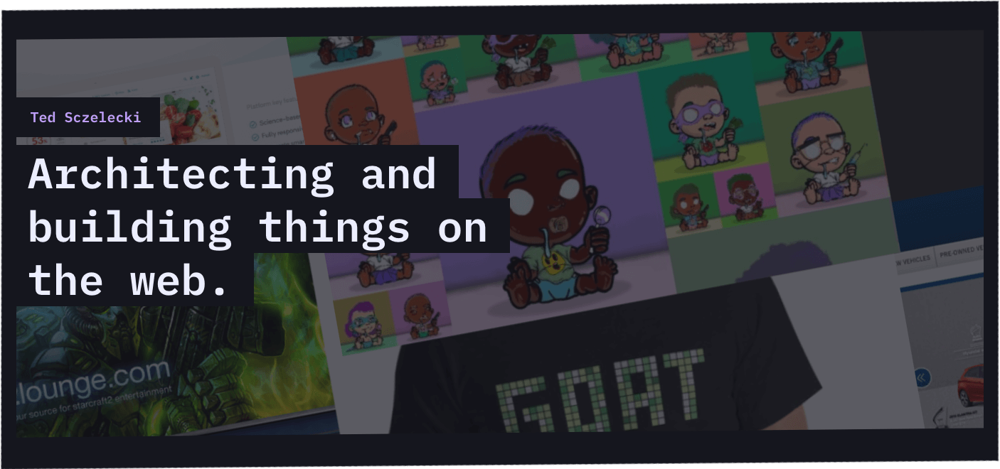

---
### Nothing is impossible. The only limitation is our imagination.
I have been building things on the web for 13+ years. I started my career building flash sites (rip) at an agency, transitioned into javascript-heavy sites, and never looked back. Recently, I have worked at various startups building React interfaces and working with designers to create clean, usable UIs. From time to time, I build (and actually finish) sites or apps where I teach myself new frameworks and hone my programming skills. In my latest projects, I am building serverless APIs while working on my own framework to kick-start the next idea.

